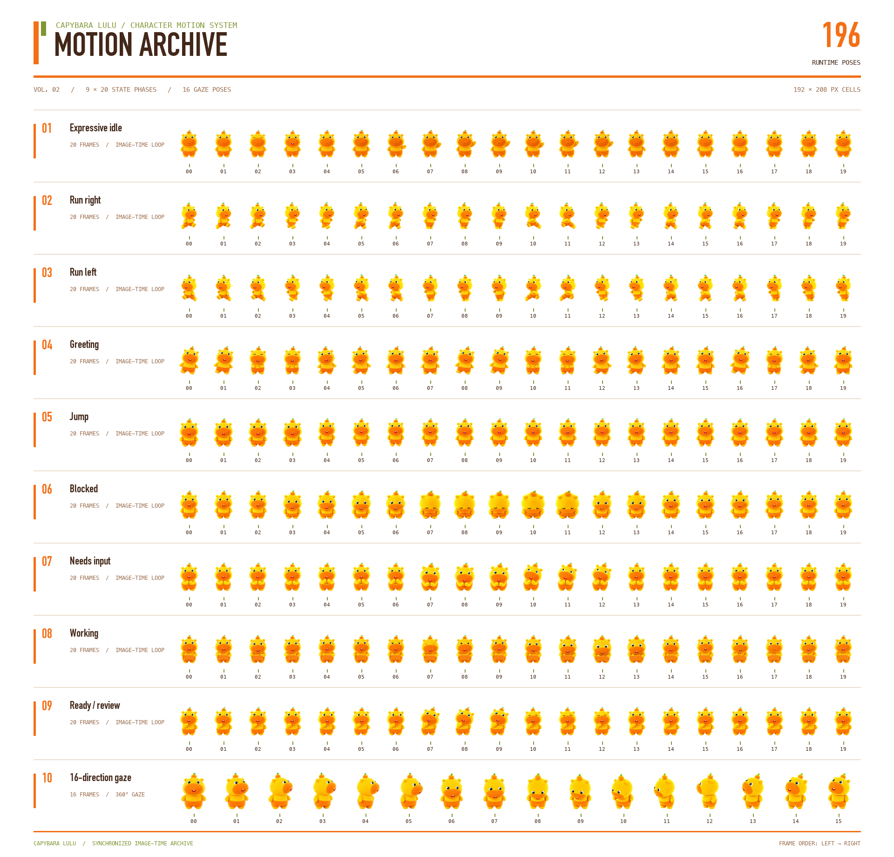
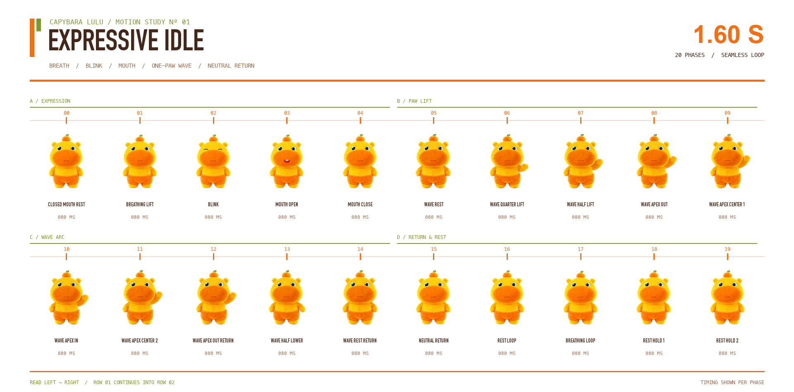
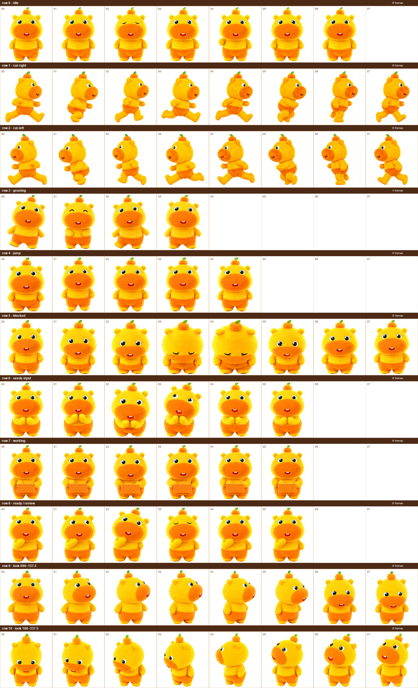
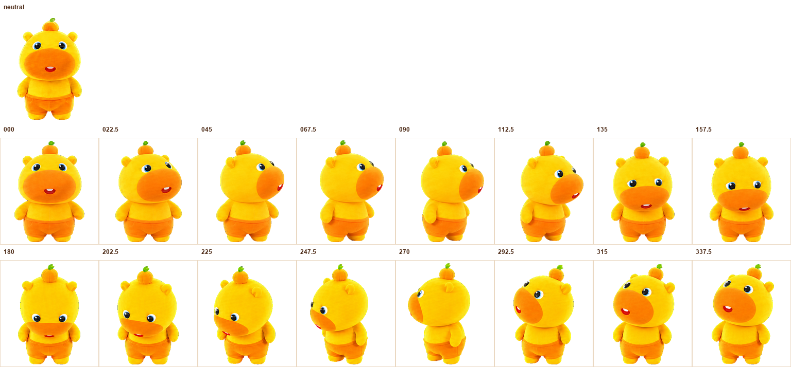

<p align="center">
  
</p>

<p align="center">
  
</p>

<p align="center">
  <a href="README.md">English</a> · <a href="README.zh-CN.md">简体中文</a>
</p>

<p align="center">
  
</p>

## 🧡 Meet Lulu

Capybara Lulu is a custom pet pack for the ChatGPT desktop app's Codex experience. Lulu breathes, blinks, opens her mouth, and waves with one paw while idle; runs when dragged; follows the pointer; and reacts when Codex is working, waiting for input, ready for review, or blocked.

> [!TIP]
> **Ready to meet Lulu?** Run `python3 scripts/install.py`, restart the ChatGPT desktop app, then choose **水豚噜噜** in **Settings → Pets**.

The shipped `pet/spritesheet.webp` is an animated 8 × 11 atlas. Its 16-frame, 2.13-second image-time idle loop prevents the long frozen holds caused by the desktop renderer's slower sprite-column clock. The static atlas remains available for QA, editing, and reduced-motion fallback.

- 🌿 **Expressive at rest.** Breathing, blinking, mouth movement, a one-paw wave, and a soft neutral return share one seamless idle timeline.
- 💻 **Aware of the task.** Working, waiting, review, and blocked states each have their own readable reaction.
- 🐾 **Responsive on the desktop.** Lulu jumps on hover and alternates her gait while being dragged left or right.
- 👀 **Able to follow you.** Sixteen clockwise gaze poses cover the full pointer circle in 22.5° steps.
- 🎞️ **Complete behind the scenes.** All 83 transparent PNG frames, GIF previews, build tools, and validators are included.

## 🎬 Motion library

Each motion keeps its original playback speed. The cards below show the live preview, the state name used by Codex, the trigger, and a direct route to every source frame.

<p>
  
  <strong>🌿 Expressive idle</strong><br>
  <sub><code>idle</code> · 16 frames · 2.13 s</sub><br><br>
  Appears when no task status is active and the pointer is in the neutral dead zone. The image-time loop adds breathing, blink, mouth movement, a one-paw wave, and a neutral return.<br>
  <a href="assets/frames/idle/">Open all 16 source frames →</a>
</p>
<br clear="left">

<p>
  
  <strong>➡️ Run right</strong><br>
  <sub><code>running-right</code> · 8 frames · 1.06 s</sub><br><br>
  Appears while the floating pet is dragged toward screen-right.<br>
  <a href="assets/frames/running-right/">Open all 8 source frames →</a>
</p>
<br clear="left">

<p>
  
  <strong>⬅️ Run left</strong><br>
  <sub><code>running-left</code> · 8 frames · 1.06 s</sub><br><br>
  Appears while the floating pet is dragged toward screen-left.<br>
  <a href="assets/frames/running-left/">Open all 8 source frames →</a>
</p>
<br clear="left">

<p>
  
  <strong>👋 Greeting</strong><br>
  <sub><code>waving</code> · 4 frames · 0.70 s</sub><br><br>
  Appears as the first-awake greeting after Lulu is woken.<br>
  <a href="assets/frames/waving/">Open all 4 source frames →</a>
</p>
<br clear="left">

<p>
  
  <strong>✨ Jump</strong><br>
  <sub><code>jumping</code> · 5 frames · 0.84 s</sub><br><br>
  Appears when the pointer enters or hovers over Lulu.<br>
  <a href="assets/frames/jumping/">Open all 5 source frames →</a>
</p>
<br clear="left">

<p>
  
  <strong>🌧️ Blocked</strong><br>
  <sub><code>failed</code> · 8 frames · 1.22 s</sub><br><br>
  Appears when a chat fails, is blocked, or encounters a system error.<br>
  <a href="assets/frames/failed/">Open all 8 source frames →</a>
</p>
<br clear="left">

<p>
  
  <strong>🙋 Needs input</strong><br>
  <sub><code>waiting</code> · 6 frames · 1.01 s</sub><br><br>
  Appears when Codex needs approval, an answer, or another user decision.<br>
  <a href="assets/frames/waiting/">Open all 6 source frames →</a>
</p>
<br clear="left">

<p>
  
  <strong>💻 Working</strong><br>
  <sub><code>running</code> · 6 frames · 0.82 s</sub><br><br>
  Appears while a chat is actively working. Lulu uses the computer instead of running in place.<br>
  <a href="assets/frames/running/">Open all 6 source frames →</a>
</p>
<br clear="left">

<p>
  
  <strong>✅ Ready / review</strong><br>
  <sub><code>review</code> · 6 frames · 1.03 s</sub><br><br>
  Appears when a chat has completed and has unread activity ready to inspect.<br>
  <a href="assets/frames/review/">Open all 6 source frames →</a>
</p>
<br clear="left">

<p>
  
  <strong>👀 Look around</strong><br>
  <sub>rows 9–10 · 16 clockwise directions</sub><br><br>
  Follows the pointer while Lulu is idle, working, or greeting. The neutral/front dead zone falls back to the expressive idle.<br>
  <a href="assets/frames/look-directions/">Open all 16 direction frames →</a>
</p>
<br clear="left">

> [!NOTE]
> When several chats are active, the official priority is **Needs input → Blocked → Ready → Running**. Selecting Lulu returns you to ChatGPT; selecting an item in the activity tray opens that chat. See the official [Pets documentation](https://learn.chatgpt.com/docs/pets?surface=app).

README GIFs retain transparent backgrounds so Lulu sits naturally on light and dark GitHub themes. The overview sheets use a pure white editorial canvas; all 83 source PNGs and installable atlases retain their original transparency.

## 🖼️ Every animation frame

All 83 shipped frames are available as individual transparent PNGs under [`assets/frames`](assets/frames/). The machine-readable timing and direction map lives in [`assets/frames/manifest.json`](assets/frames/manifest.json).

<p align="center">
  
</p>

### 🌿 Expressive idle timeline

The idle loop is deliberately dense: it returns through lower transition poses rather than snapping from a raised paw to neutral. The viewer-right paw waves; the viewer-left paw stays lowered.

<p align="center">
  
</p>

### 👀 Sprite atlas and gaze QA

<details>
<summary>🧩 Open the full 8 × 11 sprite atlas contact sheet</summary>

<p align="center">
  
</p>

</details>

<details>
<summary>🧭 Open the neutral plus 16-direction gaze sheet</summary>

<p align="center">
  
</p>

</details>

## 🐾 Install in Codex

### ⚡ One-command local install

Download or clone the repository, then run this from the project root:

```bash
python3 scripts/install.py
```

The installer:

1. copies `pet/pet.json` and `pet/spritesheet.webp` to `~/.codex/pets/capybara-lulu/`;
2. backs up an existing installation under `~/.codex/backups/capybara-lulu/`;
3. sets `[desktop].selected-avatar-id` to `custom:capybara-lulu` in `~/.codex/config.toml`.

Use `python3 scripts/install.py --no-select` if you only want to stage the pet. Fully quit and reopen the ChatGPT desktop app after installation because the custom-pet list is process-cached.

### 🧰 Manual install

macOS and Linux:

```bash
mkdir -p ~/.codex/pets/capybara-lulu
cp pet/pet.json pet/spritesheet.webp ~/.codex/pets/capybara-lulu/
```

Windows PowerShell:

```powershell
$target = Join-Path $HOME ".codex/pets/capybara-lulu"
New-Item -ItemType Directory -Force -Path $target | Out-Null
Copy-Item pet/pet.json, pet/spritesheet.webp -Destination $target -Force
```

Then open **Settings → Pets**, choose **Refresh**, and select **水豚噜噜**. Use `/pet`, **Wake Pet**, or **Tuck Away Pet** to show or hide the floating overlay. The selected pet and its position persist across restarts.

If the current client does not select Lulu through the UI, add this to `~/.codex/config.toml` and restart:

```toml
[desktop]
selected-avatar-id = "custom:capybara-lulu"
```

### 🔁 Keep task animations looping at their original speed (macOS, optional)

The desktop renderer normally plays a non-idle row three times and then falls back to idle, even when Codex is still working or waiting. This opt-in patch keeps the selected action repeating for the full lifetime of its real desktop state. It does **not** slow frames down, delay state changes, or keep a completed working state alive.

The patch verifies ASAR integrity and creates a timestamped backup before writing:

```bash
node hatch-pet/scripts/patch_codex_pet_playback.mjs --check /Applications/ChatGPT.app
node hatch-pet/scripts/patch_codex_pet_playback.mjs --apply /Applications/ChatGPT.app
```

Fully quit and reopen ChatGPT afterward. Application updates may replace the renderer patch; rerun `--check` after an update. The command output includes `backupDir` for an exact restore if needed.

### ⌨️ Codex CLI

In an interactive Codex CLI session, enter `/pets` or `/pet` and choose **水豚噜噜**. Terminal pets require iTerm2 3.6+, Kitty graphics, or Sixel support and are unavailable inside tmux and Zellij. The IDE extension does not provide a pet picker or floating overlay.

### 🔗 HTTPS install link

Codex accepts pet install links with an HTTPS spritesheet URL. This repository's ready-to-share link is:

```text
codex://pets/install?name=%E6%B0%B4%E8%B1%9A%E5%99%9C%E5%99%9C&description=Capybara%20Lulu%20desktop%20pet&imageUrl=https%3A%2F%2Fraw.githubusercontent.com%2Fsrwang0506%2FHatchPet-CapybaraLulu%2Fmain%2Fpet%2Fspritesheet.webp&spriteVersionNumber=2
```

Only `name`, `description`, `imageUrl`, and `spriteVersionNumber` are accepted. `imageUrl` must be an absolute HTTPS URL. `spriteVersionNumber=2` is the Codex 8 × 11 sprite protocol; it is not this project's release number.

## ⚙️ Codex and Claude Code configuration

- 🟢 **ChatGPT desktop app · Codex — native overlay.** Run `python3 scripts/install.py`, restart the app, then select Lulu in **Settings → Pets**.
- 🟠 **Codex CLI — native in supported terminals.** Install the same local package and select Lulu with `/pets` in iTerm2 3.6+, Kitty graphics, or Sixel-capable terminals.
- ⚪ **Codex IDE extension — no pet surface.** Use the desktop app or Codex CLI when you want the floating companion.
- 🔵 **Claude Code — project maintenance only.** It can work with the repository, source frames, and docs, but copying `pet/` into `~/.claude` does not create a desktop overlay.

Claude Code can still maintain the project cleanly:

```bash
git clone https://github.com/srwang0506/HatchPet-CapybaraLulu.git
cd HatchPet-CapybaraLulu
claude
```

The checked-in [`CLAUDE.md`](CLAUDE.md) and [`AGENTS.md`](AGENTS.md) preserve Lulu's identity and validation rules. Claude Code discovers project instructions from `CLAUDE.md`; its reusable skills live under `~/.claude/skills/` or `.claude/skills/`, as described in Anthropic's official [Skills documentation](https://code.claude.com/docs/en/skills).

The bundled [`hatch-pet`](hatch-pet/) workflow is the Codex authoring and QA tool used to build this pet. It calls Codex image-generation capabilities and writes the Codex pet contract, so copying it into Claude Code does **not** add a pet renderer or guarantee that its image-generation steps are available. A true Claude Code desktop companion would need a separate renderer and a hook bridge; this repository does not pretend that native support exists.

## 🧩 Optional: install the authoring skill in Codex

The repository includes the upgraded `hatch-pet` skill with smooth image-time idle packaging, expressive phase manifests, 9-state QA, and 16-direction validation.

```bash
mkdir -p ~/.codex/skills/hatch-pet
rsync -a hatch-pet/ ~/.codex/skills/hatch-pet/
```

Restart Codex or reload skills, then invoke `$hatch-pet` when creating or repairing a pet. This step is optional for using Lulu; the ready-to-install pet is already in [`pet/`](pet/).

## ♿ Reduced motion

Official pets respect the operating system reduced-motion preference. This project's smooth idle uses the animated WebP image clock, which can continue even when JavaScript sprite timers are reduced. If continuous idle motion is not appropriate, replace the installed runtime with the static QA atlas:

```bash
cp assets/spritesheet-static.webp ~/.codex/pets/capybara-lulu/spritesheet.webp
```

Restart the app afterward. The task states and 16 look directions remain available; only the expressive image-time idle wrapper is removed.

## 🧪 Development and validation

Create an environment and rebuild the public galleries:

```bash
python3 -m venv .venv
source .venv/bin/activate
python -m pip install -r requirements.txt
python scripts/build_gallery.py
```

Validate both the static source and the complete animated runtime:

```bash
python hatch-pet/scripts/validate_atlas.py \
  assets/spritesheet-static.webp \
  --chroma-key '#FF00FF' \
  --require-v2

python hatch-pet/scripts/validate_atlas.py \
  pet/spritesheet.webp \
  --chroma-key '#FF00FF' \
  --require-v2 \
  --allow-animated \
  --allow-transparent-rgb-residue

python hatch-pet/scripts/validate_smooth_idle_webp.py \
  pet/spritesheet.webp \
  --source-atlas assets/spritesheet-static.webp \
  --phase-manifest assets/idle-phases.json

python -m unittest discover -s hatch-pet/tests -v
```

Acceptance targets:

- static and runtime atlases are exactly 1536 × 2288 RGBA;
- `spriteVersionNumber` remains `2`;
- runtime contains 16 frames totaling 2130 ms and loops indefinitely;
- all renderer-selectable idle columns remain phase-synchronized;
- rows 1–10 are render-identical across every runtime frame;
- no eyebrows, tail, extra limbs, limb switching, gait reversal, or baseline pop appears.

## 🗂️ Repository layout

```text
capybara-lulu/
├── assets/                 # teaser, avatar, GIFs, 83 PNG frames, QA sheets
├── hatch-pet/              # authoring skill, deterministic tools, references, tests
├── pet/                    # install-ready Codex package
├── scripts/                # installer and gallery builder
├── AGENTS.md               # Codex contributor constraints
├── CLAUDE.md               # Claude Code project context
├── README.md               # English documentation
└── README.zh-CN.md         # 简体中文文档
```

## 🤝 Contributing

Read [`CONTRIBUTING.md`](CONTRIBUTING.md) before changing art or timing. Visual changes must include regenerated GIFs and galleries plus deterministic validation. Security issues should follow [`SECURITY.md`](SECURITY.md).

## 📜 License and names

Code, documentation, and repository assets are provided under the [Apache License 2.0](LICENSE), subject to the rights described in [`NOTICE`](NOTICE). This is an independent project and is not affiliated with OpenAI or Anthropic. Codex, ChatGPT, Claude, and Claude Code remain the property of their respective owners.
