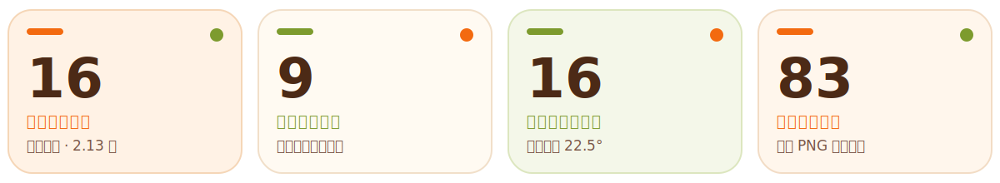

<p align="center">
  
</p>

<p align="center">
  
</p>

<p align="center">
  <a href="README.md">English</a> · <a href="README.zh-CN.md">简体中文</a>
</p>

<p align="center"><strong>一只温暖、灵动、会陪 Codex 一起工作的水豚噜噜。</strong></p>

<p align="center">
  
</p>

<p align="center">
  
</p>

## 🧡 认识噜噜

Capybara Lulu 是为 ChatGPT 桌面端 Codex 体验制作的自定义桌宠。没有任务时，噜噜会呼吸、眨眼、张嘴并用一只小手自然挥动；拖动时会左右跑；鼠标移动时会转头注视；Codex 工作、等待输入、完成任务或出错时，也都有独立反应。

> [!TIP]
> **想马上见到噜噜？** 运行 `python3 scripts/install.py`，重启 ChatGPT 桌面端，然后在 **设置 → Pets** 中选择 **水豚噜噜**。

实际安装的 `pet/spritesheet.webp` 是一张带时间轴的 8 × 11 动态图集。每个原生状态都有 20 个同步时间相位，全局循环为 1.60 秒，在保持动作流畅的同时，让噜噜不再显得着急。15 个具名视觉动作片段被分配到 9 个真实 Codex 触发状态中；仓库同时保留静态图集，供质量检查、二次编辑和减少动态效果时使用。

| 噜噜的能力 | 仓库中实际提供的内容 |
| :--- | :--- |
| 🌿 **灵动静止** | 20 个时间相位：休息、呼吸、眨眼、张嘴与闭嘴、单手挥动，以及柔和的中性回归。 |
| 💻 **任务感知** | 工作中、等待输入、完成待查看与失败/阻塞各有独立反应；仅工作状态就包含敲键、眨眼、低头读屏和另一组交替敲键四个微循环。 |
| 🐾 **桌面互动** | 鼠标悬停时跳跃；向左或向右拖动时，以交替步态连续跑动。 |
| 👀 **方向注视** | 16 个顺时针注视姿态，以 22.5° 精确间隔覆盖完整指针方向；中性死区自动回到静止状态。 |
| 🎞️ **可复现素材** | 180 张透明运行相位 PNG、87 张原生/注视源图、10 个 GIF 预览、确定性构建器、验证器，以及完整的 `hatch-pet` 工作流。 |

## 🎬 动作图鉴

所有动态预览都采用与实际运行包一致的 80 ms 相位节奏。下面的无边框动作卡片同时展示 Codex 状态名、触发条件以及对应的全部源帧。

<p>
  
  <strong>🌿 灵动静止</strong><br>
  <sub><code>idle</code> · 20 相位 · 1.60 秒</sub><br><br>
  没有活动任务状态、且鼠标位于中性死区时出现。WebP 时间轴会连续播放呼吸、眨眼、张嘴、单手挥动与自然回正。<br>
  <a href="assets/state-phases/idle/">查看全部 20 个运行相位 →</a>
</p>
<br clear="left">

<p>
  
  <strong>➡️ 向右跑</strong><br>
  <sub><code>running-right</code> · 20 相位 · 1.60 秒</sub><br><br>
  向屏幕右侧拖动悬浮桌宠时出现。<br>
  <a href="assets/state-phases/running-right/">查看全部 20 个运行相位 →</a>
</p>
<br clear="left">

<p>
  
  <strong>⬅️ 向左跑</strong><br>
  <sub><code>running-left</code> · 20 相位 · 1.60 秒</sub><br><br>
  向屏幕左侧拖动悬浮桌宠时出现。<br>
  <a href="assets/state-phases/running-left/">查看全部 20 个运行相位 →</a>
</p>
<br clear="left">

<p>
  
  <strong>👋 打招呼</strong><br>
  <sub><code>waving</code> · 20 相位 · 1.60 秒</sub><br><br>
  唤醒噜噜后，作为首次醒来问候出现。<br>
  <a href="assets/state-phases/waving/">查看全部 20 个运行相位 →</a>
</p>
<br clear="left">

<p>
  
  <strong>✨ 跳跃</strong><br>
  <sub><code>jumping</code> · 20 相位 · 1.60 秒</sub><br><br>
  鼠标进入或悬停在噜噜上方时出现。<br>
  <a href="assets/state-phases/jumping/">查看全部 20 个运行相位 →</a>
</p>
<br clear="left">

<p>
  
  <strong>🌧️ 失败 / 阻塞</strong><br>
  <sub><code>failed</code> · 20 相位 · 1.60 秒</sub><br><br>
  对话失败、任务被阻塞或遇到系统错误时出现。<br>
  <a href="assets/state-phases/failed/">查看全部 20 个运行相位 →</a>
</p>
<br clear="left">

<p>
  
  <strong>🙋 等待输入</strong><br>
  <sub><code>waiting</code> · 20 相位 · 1.60 秒</sub><br><br>
  Codex 需要审批、回答或其他用户决定时出现。<br>
  <a href="assets/state-phases/waiting/">查看全部 20 个运行相位 →</a>
</p>
<br clear="left">

<p>
  
  <strong>💻 工作中</strong><br>
  <sub><code>running</code> · 20 个独立相位 · 1.60 秒</sub><br><br>
  对话正在工作时出现。噜噜会交替敲键、眨眼、低头读屏再换手敲键；20 个相位里两只手都始终与身体连接。<br>
  <a href="assets/state-phases/running/">查看全部 20 个运行相位 →</a>
</p>
<br clear="left">

<p>
  
  <strong>✅ 完成 / 检查成果</strong><br>
  <sub><code>review</code> · 20 相位 · 1.60 秒</sub><br><br>
  对话已经完成、且存在尚未查看的活动时出现。<br>
  <a href="assets/state-phases/review/">查看全部 20 个运行相位 →</a>
</p>
<br clear="left">

<p>
  
  <strong>👀 四处看</strong><br>
  <sub>第 9–10 行 · 16 个顺时针方向</sub><br><br>
  噜噜处于静止、工作或问候状态时跟随鼠标方向；正面中性死区会回到灵动静止状态。<br>
  <a href="assets/frames/look-directions/">查看全部 16 张方向帧 →</a>
</p>
<br clear="left">

> [!NOTE]
> 多个对话同时有活动时，官方优先级为：**等待输入 → 阻塞 → 完成待查看 → 工作中**。点击噜噜会返回 ChatGPT；点击活动托盘中的项目会打开对应对话。详见 OpenAI 官方[桌宠文档](https://learn.chatgpt.com/docs/pets?surface=app)。

README 中的 GIF 均保留透明背景，在 GitHub 的浅色与深色主题下都能自然显示；动作总览图继续使用纯白编辑画布，运行相位和原生源图也都保留原始透明通道。

## 🖼️ 所有动作的每一帧

180 张状态相位均以透明 PNG 形式保存在 [`assets/state-phases`](assets/state-phases/)；再加上 16 张方向帧，构成下方 196 帧运行总览。87 张原生/静态源图仍保存在 [`assets/frames`](assets/frames/)；[`assets/state-phases.json`](assets/state-phases.json) 与 [`assets/frames/manifest.json`](assets/frames/manifest.json) 记录时序、动作片段归属和注视角度。

<p align="center">
  
</p>

### 🌿 20 相位静止时间线

挥手不是两张图上下跳变，而是完整的抬手、三个相邻顶点角度、回程、落手与中性回归。画面右侧的小手负责挥动，另一只手始终自然垂在身体侧面。

<p align="center">
  
</p>

### 👀 完整图集与注视质量检查

<details>
<summary>🧩 展开 8 × 11 完整图集接触表</summary>

<p align="center">
  
</p>

</details>

<details>
<summary>🧭 展开正面与 16 向注视检查图</summary>

<p align="center">
  
</p>

</details>

## 🐾 在 Codex 中安装

### ⚡ 一条命令安装

下载或克隆仓库后，在项目根目录运行：

```bash
python3 scripts/install.py
```

安装脚本会：

1. 将 `pet/pet.json` 和 `pet/spritesheet.webp` 复制到 `~/.codex/pets/capybara-lulu/`；
2. 把已有安装备份到 `~/.codex/backups/capybara-lulu/`；
3. 在 `~/.codex/config.toml` 中把 `[desktop].selected-avatar-id` 设置为 `custom:capybara-lulu`。

只想写入文件、不自动选中时可运行 `python3 scripts/install.py --no-select`。安装后必须完全退出并重新打开 ChatGPT 桌面端，因为自定义宠物列表存在进程级缓存。

### 🧰 手动安装

macOS 与 Linux：

```bash
mkdir -p ~/.codex/pets/capybara-lulu
cp pet/pet.json pet/spritesheet.webp ~/.codex/pets/capybara-lulu/
```

Windows PowerShell：

```powershell
$target = Join-Path $HOME ".codex/pets/capybara-lulu"
New-Item -ItemType Directory -Force -Path $target | Out-Null
Copy-Item pet/pet.json, pet/spritesheet.webp -Destination $target -Force
```

随后打开 **设置 → Pets**，点击 **Refresh**，选择 **水豚噜噜**。使用 `/pet`、**Wake Pet** 或 **Tuck Away Pet** 显示或收起桌面悬浮层。宠物选择与位置会在重启后保留。

如果当前客户端没有通过界面选中噜噜，可在 `~/.codex/config.toml` 中加入以下内容并重启：

```toml
[desktop]
selected-avatar-id = "custom:capybara-lulu"
```

### 🔁 让任务动作保持原速循环（macOS，可选）

桌面渲染器默认只把非静止动作播放三轮，随后即使 Codex 仍在工作或等待，也会回到静止画面。这个可选补丁会让当前动作在对应真实状态存在期间持续重复。它**不会**把单帧放慢、拖延状态切换，也不会在任务已经完成后强行保留“工作中”。

补丁写入前后都会验证 ASAR 完整性，并自动建立带时间戳的备份：

```bash
node hatch-pet/scripts/patch_codex_pet_playback.mjs --check /Applications/ChatGPT.app
node hatch-pet/scripts/patch_codex_pet_playback.mjs --apply /Applications/ChatGPT.app
```

执行后必须完全退出并重新打开 ChatGPT。应用更新可能覆盖补丁，更新后应重新运行 `--check`。命令输出中的 `backupDir` 可用于精确恢复。

### ⌨️ Codex CLI

在交互式 Codex CLI 中输入 `/pets` 或 `/pet`，然后选择 **水豚噜噜**。终端宠物需要 iTerm2 3.6+、Kitty 图形协议或 Sixel 支持，在 tmux 和 Zellij 内不可用。Codex IDE 扩展目前不提供宠物选择器或悬浮桌宠。

### 🔗 HTTPS 安装链接

Codex 支持通过 HTTPS 图集地址打开宠物安装流程。本仓库可直接分享的链接如下：

```text
codex://pets/install?name=%E6%B0%B4%E8%B1%9A%E5%99%9C%E5%99%9C&description=Capybara%20Lulu%20desktop%20pet&imageUrl=https%3A%2F%2Fraw.githubusercontent.com%2Fsrwang0506%2FHatchPet-CapybaraLulu%2Fmain%2Fpet%2Fspritesheet.webp&spriteVersionNumber=2
```

安装链接只接受 `name`、`description`、`imageUrl` 与 `spriteVersionNumber`。`imageUrl` 必须是绝对 HTTPS 地址。`spriteVersionNumber=2` 是 Codex 8 × 11 图集协议字段，不是本项目的发布版本号。

## ⚙️ Codex 与 Claude Code 配置说明

| 使用环境 | 支持情况 | 推荐配置方式 |
| :--- | :---: | :--- |
| 🟢 **ChatGPT 桌面端 · Codex** | **原生悬浮桌宠** | 运行 `python3 scripts/install.py`，重启应用，然后在 **设置 → Pets** 中选择 **水豚噜噜**。 |
| 🟠 **Codex CLI** | **受支持终端中原生显示** | 安装同一本地宠物包，再在 iTerm2 3.6+、Kitty 图形协议或支持 Sixel 的终端中通过 `/pets` 选择。 |
| ⚪ **Codex IDE 扩展** | **没有桌宠界面** | 需要看到悬浮噜噜时，请使用 ChatGPT 桌面端或 Codex CLI。 |
| 🔵 **Claude Code** | **仅用于维护项目** | Claude 可以编辑仓库、源帧与文档；把 `pet/` 复制到 `~/.claude` 不会出现悬浮桌宠。 |

Claude Code 仍然可以完整参与项目维护：

```bash
git clone https://github.com/srwang0506/HatchPet-CapybaraLulu.git
cd HatchPet-CapybaraLulu
claude
```

仓库中的 [`CLAUDE.md`](CLAUDE.md) 与 [`AGENTS.md`](AGENTS.md) 会约束噜噜的角色特征与验证流程。Claude Code 会读取项目级 `CLAUDE.md`；其可复用 Skill 位于 `~/.claude/skills/` 或 `.claude/skills/`，详见 Anthropic 官方 [Skills 文档](https://code.claude.com/docs/en/skills)。

随仓库提供的 [`hatch-pet`](hatch-pet/) 是构建本项目时使用的 Codex 生成与质量检查工具。它依赖 Codex 的图像生成能力并输出 Codex 宠物协议，因此复制到 Claude Code **不等于**获得桌宠渲染器，也不保证图像生成步骤可用。若要让 Claude Code 真正驱动桌面宠物，需要独立渲染器和 Hook 状态桥；本仓库不会把尚不存在的原生支持写成已支持。

## 🧩 可选：在 Codex 中安装创作 Skill

仓库包含升级后的 `hatch-pet` Skill，支持原生状态 16–24 相位同步打包、12–15 个视觉动作库、整组肢体连接检查、9 状态质量检查与 16 向注视验证。

```bash
mkdir -p ~/.codex/skills/hatch-pet
rsync -a hatch-pet/ ~/.codex/skills/hatch-pet/
```

重启 Codex 或重新加载 Skills，之后可通过 `$hatch-pet` 创建或修复宠物。只使用现成噜噜不需要安装 Skill；可直接安装 [`pet/`](pet/) 中的宠物包。

## ♿ 减少动态效果

官方宠物会尊重操作系统的“减少动态效果”设置。本项目的同步状态运行图集使用动态 WebP 自身的图像时钟，在 JavaScript 精灵定时器被减少时仍可能继续播放。如果持续的图像时间轴动画不适合你的使用场景，可将已安装运行图集替换为静态质量检查图集：

```bash
cp assets/spritesheet-static.webp ~/.codex/pets/capybara-lulu/spritesheet.webp
```

替换后重启应用。9 个任务状态和 16 向注视仍然保留，只移除了同步图像时间轴包装。

## 🧪 开发与验证

创建环境并重建公开素材：

```bash
python3 -m venv .venv
source .venv/bin/activate
python -m pip install -r requirements.txt
python scripts/build_gallery.py
```

验证静态源图集和完整动态运行图集：

```bash
python hatch-pet/scripts/validate_atlas.py \
  assets/spritesheet-static.webp \
  --chroma-key '#FF00FF' \
  --require-v2

python hatch-pet/scripts/validate_atlas.py \
  pet/spritesheet.webp \
  --chroma-key '#FF00FF' \
  --require-v2 \
  --allow-animated \
  --allow-transparent-rgb-residue

python hatch-pet/scripts/validate_smooth_state_webp.py \
  pet/spritesheet.webp \
  --source-atlas assets/spritesheet-static.webp \
  --phase-manifest assets/state-phases.json \
  --require-all-states \
  --min-motion-clips 12 \
  --max-motion-clips 15

python hatch-pet/scripts/measure_motion_phase_continuity.py \
  assets/state-phases/running \
  --expected-count 20 \
  --chroma-key '#FF00FF'

python -m unittest discover -s hatch-pet/tests -v
```

验收目标：

- 静态与动态运行图集均为 1536 × 2288 RGBA；
- `spriteVersionNumber` 必须保持为 `2`；
- 动态运行图集共 20 相位、1600 ms、无限循环；
- 9 个原生状态的所有可选列都保持同相；
- 两个注视行与静态质量检查图集渲染完全一致；
- 15 个具名视觉动作均映射到真实原生触发状态；
- 不得出现眉毛、尾巴、断开或多余肢体、换手、步态倒退或基线跳动。

## 🗂️ 仓库结构

```text
capybara-lulu/
├── assets/                 # teaser、头像、GIF、267 张透明 PNG 与质量检查图
├── hatch-pet/              # 创作 Skill、确定性脚本、参考规范与测试
├── pet/                    # 可直接安装的 Codex 宠物包
├── scripts/                # 安装器与素材画廊生成器
├── AGENTS.md               # Codex 贡献约束
├── CLAUDE.md               # Claude Code 项目上下文
├── README.md               # 英文文档
└── README.zh-CN.md         # 简体中文文档
```

## 🤝 参与贡献

修改画面或时序前请阅读 [`CONTRIBUTING.md`](CONTRIBUTING.md)。视觉改动必须同步重建 GIF 与总览图，并通过确定性验证。安全问题请按 [`SECURITY.md`](SECURITY.md) 提交。

## 📜 许可证与名称

代码、文档及仓库素材按 [Apache License 2.0](LICENSE) 提供，但仍受 [`NOTICE`](NOTICE) 中所述权利边界约束。本项目为独立项目，与 OpenAI、Anthropic 无隶属关系。Codex、ChatGPT、Claude 与 Claude Code 等名称归各自权利人所有。
